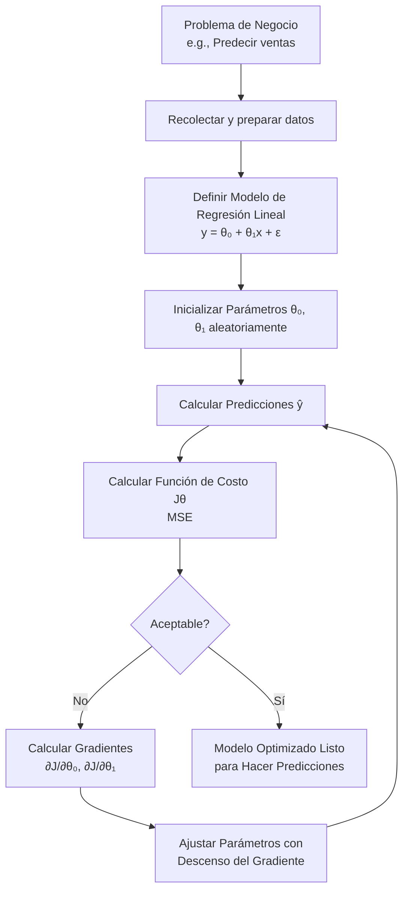

# AI-Handbook

```mermaid
flowchart TD
A[Problema de Negocio<br>e.g., Predecir ventas] --> B[Recolectar y preparar datos]
B --> C[Definir Modelo de Regresión Lineal<br>y = θ₀ + θ₁x + ε]
C --> D[Inicializar Parámetros θ₀, θ₁ aleatoriamente]
D --> E[Calcular Predicciones ŷ]
E --> F[Calcular Función de Costo Jθ<br>MSE]
F --> G{Aceptable?}
G -- No --> H[Calcular Gradientes<br>∂J/∂θ₀, ∂J/∂θ₁]
H --> I[Ajustar Parámetros con<br>Descenso del Gradiente]
I --> E
G -- Sí --> J[Modelo Optimizado Listo<br>para Hacer Predicciones]
```
